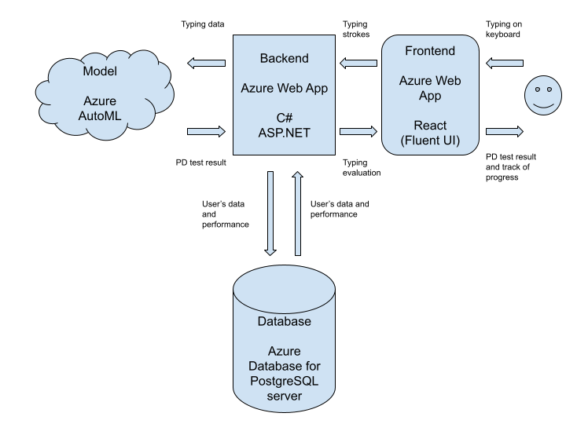
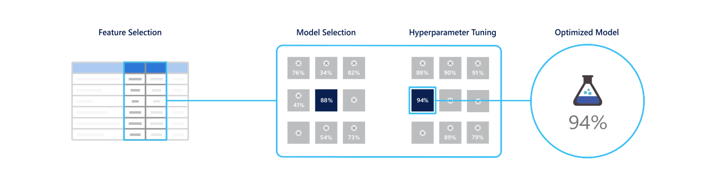
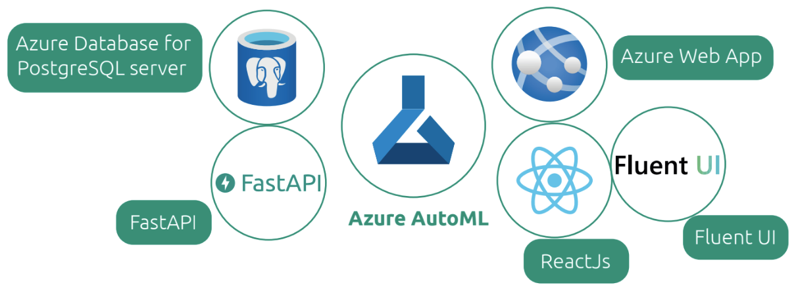

# PDglint

## Inspiration story

David is a husband and a father. At the age of 64, his wife noticed a thumb tremor on his left hand. In less than two weeks, tremors reached his head and both arms. After consulting several doctors, he was referred to a neurologist. When the neurologist observed David, he did some tests and then informed David that he had advanced **Parkinson's disease**.

## What it does

Our solution PDglint is a web application that provides solutions for **the early diagnosis of Parkinson's disease** on a real-time basis and uses technologies to monitor the progress of patient treatment.
The web application will prompt random words to the user who will type them one by one directly on his keyboard. When he finishes all words, the record will be sent to the backend that will execute some data filtering and manipulation using an external service. Then the backend will send a proper request to Azure AutoML Model. After getting the response, the backend will send back the results to the web app. Data will be stored to keep track of the user improvement.

## How we built it

### Software architecture

Our app is built on top of Azure Machine Learning for creating the model that predicts the presence of Parkinson's disease. We used ReactJS for the frontend to create a friendly user interface that makes it clean. We used Azure Functions to make data pretreatment for cost efficiency. We also used C# and ASP.NET to create an API that links the frontend with Azure Functions, the database as well as our deployed model.

### Dataset

The dataset used contains keystroke logs of multiple characteristics of finger movement while typing, collected from over 200 subjects, with and without Parkinson's Disease.
After processing the data, we used Azure AutoML to find the best model and we reached an accuracy of 87,5 %.
Tappy Keystroke Data: [https://physionet.org/content/tappy/1.0.0/](https://physionet.org/content/tappy/1.0.0/)

### Model

We automatically trained and tuned a model for the dataset and target metric using Azure AutoML that tests multiple algorithms and hyper-parameters in parallel to generate the most suitable model.

## Challenges we ran into

- Cleaning the dataset before training it with Azure AutoML.
- Recording client's inputs in the frontend.

## Accomplishments that we're proud of

Creating a minimum viable product that solves a healthcare problem.

## What we learned

- Creating a model with Azure AutoML!
- Using ASP.NET and C#, which is fast to code and easy to use :D
- Trying Fluent UI to stylize the web app, and setting a dark theme ;)
- Using Unicorn for the production (deploying the backend which is built with ASP.NET in Azure).

## What's next for PDglint

- Desktop app that tracks users' inputs in the background (taking into account the privacy of the user's inputs).
- Adding statistics to users and monitor their progress.
- Improve the model accuracy by getting more training data and/or creating a specific model using Azure Machine Learning.
